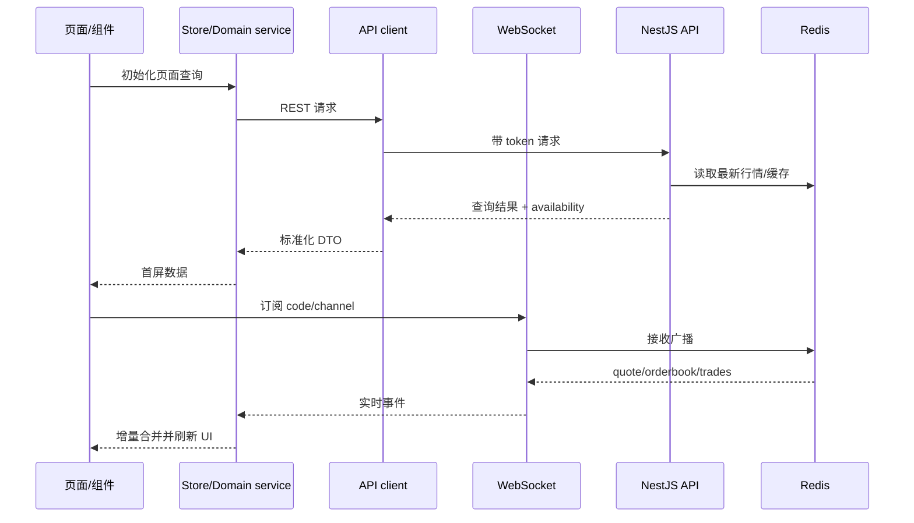
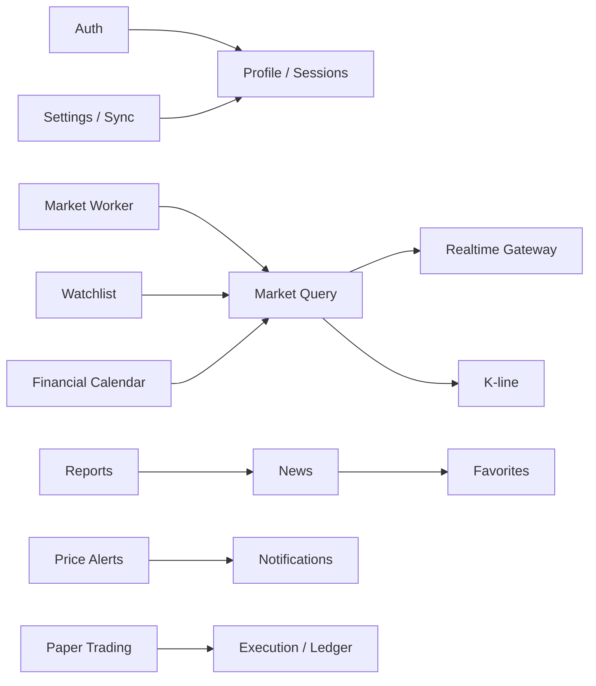

# ZEDARC 股票 Web 站点功能与技术架构

> 版本：2026-08
>
> 本文基于当前 `web`、`server/api`、`server/worker` 和 `packages/shared` 的实际代码整理。目标是统一产品边界、前后端职责、数据链路和后续演进方向。

## 1. 产品定位与边界

ZEDARC 应定位为 **行情、资讯与投资工作台**，而不是当前已经具备真实券商交易能力的证券交易系统。

### 已有能力

- 多市场行情：A 股、板块、ETF、债券、科创、港股、全球市场
- 个股详情：报价、分时/K 线、盘口、成交、相关资讯/研报
- 自选股：自选列表、分组、排序、同步
- 行情分析：涨跌排行、涨停/跌停、市场情绪、财经日历
- 资讯与研报：资讯流、详情、收藏、主题和推荐偏好
- 模拟交易：资金、持仓、委托、成交、流水、订单状态流转
- 用户能力：短信登录、个人资料、设备/会话、安全记录、设置、通知
- 实时能力：行情 WebSocket、断线重连、订阅代码动态更新
- 弱网能力：本地偏好、本地数据、离线同步队列和冲突提示

### 明确不应误导用户的能力

- 当前没有真实券商账户绑定、报单通道、交易柜台或实盘资金结算
- 短信生产接入仍需要真实供应商 adapter、模板审核、回执和密钥托管
- 行情 provider 不可用时可以展示明确的缓存/不可用状态，但不能把 mock 数据标记为实时行情

## 2. 总体技术架构

```mermaid
flowchart TB
    Browser[Vue 3 Web] --> Nginx[Nginx 静态资源与反向代理]
    Nginx --> API[NestJS API]
    Nginx --> WS[WebSocket /ws/market]
    API --> PG[(PostgreSQL)]
    API --> Redis[(Redis)]
    Worker[Market Worker] --> Provider[TDX / stock-sdk]
    Worker --> Redis
    Redis --> API
    Redis --> WS
    API --> Shared[@zedarc/shared 类型与协议]
    Worker --> Shared
```

### 分层职责

| 层 | 技术 | 主要职责 |
|---|---|---|
| 展示层 | Vue 3 + Vue Router + TypeScript | 页面、交互、响应式布局、状态展示、错误/空数据状态 |
| 前端领域层 | `services/*`、`stores/*` | API/WS 适配、行情合并、自选/收藏/认证/交易状态、本地同步 |
| 接入层 | Nginx | 静态资源、SPA fallback、API/WS 反代、健康检查 |
| API 层 | NestJS + Fastify | 认证、用户数据、行情查询、资讯、研报、模拟交易、通知 |
| 实时层 | NestJS WebSocket + Redis | 行情订阅、广播、连接管理、断线重连配合 |
| 数据采集层 | Node.js Worker | 从 TDX/stock-sdk 拉取行情，标准化、缓存、发布实时事件 |
| 持久化层 | PostgreSQL + Drizzle | 用户、自选、收藏、告警、设置、交易订单/成交/账本 |
| 热数据层 | Redis | 最新行情、K 线、Pub/Sub、provider 状态、临时登录/告警状态 |
| 共享契约层 | `@zedarc/shared` | 行情、K 线、provider 能力和跨端 DTO 的共享类型 |

## 3. 前端信息架构

### 一级导航

- **资讯**：资讯流、快讯、主题、资讯收藏
- **自选**：自选列表、自选分组、股票提醒
- **行情**：市场总览、排行、板块、ETF、债券、科创、港股、全球市场、财经日历
- **交易**：模拟账户、持仓、委托、成交、资金流水
- **我的**：账户、通知、设置、资料、设备和安全、反馈

### 页面与领域映射

| 领域 | 页面入口 | 前端服务/状态 |
|---|---|---|
| 行情 | `MarketPage`、`StockDetailPage`、板块/ETF/债券页面 | `market.ts`、`kline.ts`、`market-socket.ts`、图表偏好 store |
| 自选 | `WatchlistPage`、`WatchlistGroupsPage` | `watchlist.ts`、`favorites.ts` |
| 资讯 | `NewsPage`、`NewsDetailPage`、主题页面 | `news.ts`、`news-recommendations.ts` |
| 研报 | `ReportsPage`、`ReportDetailPage` | `reports.ts` |
| 交易 | `TradePage` 及 positions/orders/funds 子页面 | `trade.ts`、`trade-socket.ts` |
| 用户 | `AccountPage`、`ProfilePage`、`SecurityPage`、`DevicesPage` | `auth.ts`、`api-client.ts`、`settings.ts` |
| 弱网 | 设置页与全局数据层 | `local-db.ts`、`offline-sync.ts`、`local-transfer.ts` |

### 前端建议的统一数据流



### 前端必须统一的交互状态

所有行情、资讯、研报和交易列表统一支持：

1. `loading`：首次加载骨架屏，不阻塞已有数据刷新
2. `ready`：展示数据和最后更新时间
3. `refreshing`：后台刷新时保留旧数据
4. `empty`：明确说明“没有符合条件的数据”
5. `unavailable`：provider 未提供该数据，不使用 mock 冒充
6. `error`：展示可重试动作和 request id（若有）
7. `stale/cache`：展示缓存时间和数据来源

## 4. 后端模块划分

当前 API 模块可按以下领域维护，不建议继续把逻辑集中到单一 `market` 或 `trade` 模块：



### API 领域职责

- `auth`：短信验证码、登录、刷新、登出、当前用户、会话撤销
- `market`：市场概览、股票/板块/ETF/债券查询、provider 状态
- `kline`：周期、复权、指标参数和 K 线数据
- `realtime`：WebSocket 连接、订阅、广播、消息校验
- `watchlist`：用户自选、分组、排序和同步元数据
- `favorites`：通用收藏能力；资讯收藏单独保留其分类/标签/笔记语义
- `news` / `reports`：资讯、主题、推荐、研报及相关证券关联
- `alerts` / `notifications`：价格提醒的持久化、触发状态和通知记录
- `trade`：模拟账户、订单校验、订单状态机、成交、资金/持仓/账本
- `calendar`：分红、财报、IPO、宏观事件；必须返回 provider 可用性
- `settings`：用户设置版本、更新时间和离线同步冲突处理
- `health`：存活、就绪、指标和 provider 状态

## 5. 数据架构

### PostgreSQL：事实与用户数据

建议将 PostgreSQL 视为最终事实源，保存：

- 用户、刷新令牌、会话、登录历史
- 自选股及分组、资讯收藏、研报收藏、推荐偏好
- 价格告警、通知记录、用户设置
- 模拟交易账户、订单、订单事件、成交、资金流水、双式账本

交易相关数据必须遵守：

- 下单使用 `requestId` 幂等
- 订单状态只能通过明确的状态机迁移
- 成交、资金变更和持仓变更在同一事务中提交
- 账本是可审计记录，不能通过直接改余额修复业务问题

### Redis：派生状态与实时通道

- `market:*`：最新快照、K 线和 provider 状态
- Pub/Sub：worker 到 API/WebSocket 的行情事件
- 登录验证码、刷新令牌辅助状态、告警 active set
- 短期限流、去重、连接级订阅状态

Redis 丢失后应可以通过 worker/API 重建派生缓存；不能把不可重建的用户事实只放在 Redis。

### 数据源策略

```text
TDX（首选）
  -> 失败时 stock-sdk fallback
  -> 仍失败：返回 unavailable / stale 状态
  -> 仅开发演示场景允许 mock
```

worker 负责 provider 适配、字段标准化、时间戳、序列号和 stale 判断；API 不直接拼装 provider 原始数据。

## 6. 关键接口约定

### REST

- 统一前缀：`/api`
- 统一鉴权：`Authorization: Bearer <accessToken>`，refresh token 只用于刷新
- 统一错误：`status`、`code`、`message`、`requestId`
- 列表接口统一分页：`items`、`total`、`nextCursor`（或明确 page/limit）
- 行情响应包含：`source`、`available`、`asOf`、`stale`，禁止前端猜测数据是否实时
- 写接口支持幂等键，尤其是交易、收藏、同步操作

### WebSocket

建议协议稳定为：

```json
{
  "event": "subscribe",
  "data": {
    "codes": ["600519"],
    "types": ["quote", "orderbook", "trades", "kline"]
  }
}
```

服务端事件至少包含：`type`、`channel`、`code`、`timestamp`、`sequence`、`data`。客户端按 `sequence` 丢弃乱序事件，并在重连后重新订阅和请求一次 REST 快照。

## 7. 安全、可靠性与合规底线

- 生产禁用 mock 短信；真实短信 provider 必须实现专用 adapter、限流、幂等、回执、模板和密钥托管
- JWT access token 短时效，refresh token 可撤销、轮换并持久化哈希
- 登录、验证码、搜索和 WebSocket 订阅均需要限流和输入校验
- 交易模拟接口必须校验价格、数量、交易时段、资金和幂等请求
- 所有 API 日志使用结构化 JSON；以 `x-request-id` 串联 Web/API/worker
- provider 故障、缓存过期、WS 重连、API readiness 必须有指标和告警
- 明确展示“模拟交易”与数据来源，不得将演示账户或 mock 行情包装成实盘能力
- 生产只暴露 Web/Nginx，PostgreSQL、Redis 和 worker 保持内网访问

## 8. 分阶段建设顺序

### P0：收口现有 MVP

1. 固化 REST/WS DTO 和错误码，补齐 Swagger 与共享类型
2. 统一所有页面的 loading/empty/unavailable/stale/error 状态
3. 完成行情快照 + WS 增量的版本/序列校验
4. 对模拟交易补充状态机、幂等、事务和回放测试
5. 清理页面中直接访问 localStorage/API 的重复逻辑，统一 domain service/store

### P1：可用的投资工作台

1. 自选分组、价格提醒、资讯收藏形成闭环
2. 行情详情增加指标配置、事件日历和关联资讯
3. 交易增加组合收益、成本、成交回放和账本审计视图
4. 增加 provider 管理面板、缓存时间、数据质量统计
5. 增加移动端/小屏布局回归测试和 Playwright 关键路径测试

### P2：生产化与可扩展

1. provider adapter 抽象与多市场字段规范化
2. 独立行情分发层，支持多 API 实例和 WebSocket 横向扩展
3. 引入任务队列处理资讯采集、告警、通知和日历同步
4. 接入错误追踪、链路追踪、Prometheus/Grafana 告警
5. 若要做真实交易，单独建设券商接入、风控、资金与合规边界，不在当前模拟交易模块上直接改造

## 9. 当前最重要的架构结论

1. **前端是多领域工作台，不是单页行情页**：导航、路由和服务层应按领域维护。
2. **行情采用“REST 首屏快照 + WebSocket 增量”**：重连后必须重新拉快照，不能只依赖 WS。
3. **PostgreSQL 保存事实，Redis 保存派生状态**：交易账本、用户数据不能依赖缓存。
4. **provider 可用性是产品状态的一部分**：所有数据消费方都应展示来源、时间和不可用原因。
5. **模拟交易与真实交易必须隔离**：当前产品可以继续做完整的 paper trading，但不能对外宣称已具备券商交易能力。
6. **下一轮优先做契约和可靠性，而不是继续增加页面**：先统一 DTO、错误模型、状态机和测试，后续扩展成本最低。
